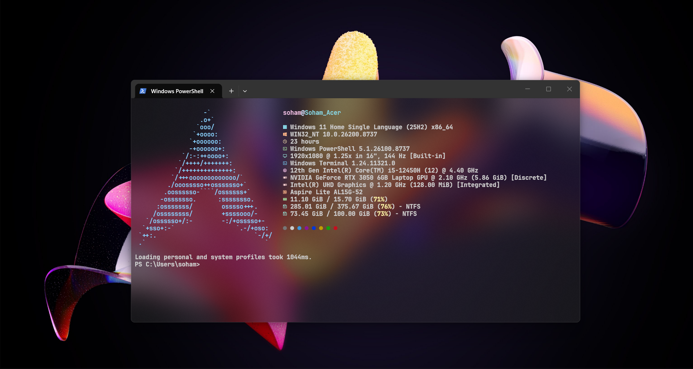

# 🚀 Asthetic Terminal (Windows Edition) 🚀



Tired of your Windows Terminal looking like a boring 1990s hacker movie? Want it to look so incredibly clean and aesthetic that it makes your friends jealous? You've come to the right place, young padawan! 

This guide is **dummy-proof**. If you can click buttons and copy-paste, you can do this. Let’s turn that crusty terminal into a glass-like, auto-completing, system-flexing masterpiece! 😎

---

## 🛠️ Ground Zero (The Basics)

1. **Windows Terminal**: Don't have it? Go to the Microsoft Store and download it. Seriously, why don't you have it yet?
2. **Nerd Font**: You need a special font so those cool little icons show up instead of weird boxes. 
   - Go to [Nerd Fonts](https://www.nerdfonts.com/font-downloads) and download **JetBrainsMono Nerd Font**.
   - Unzip the folder, select all the font files inside, right-click -> **Install**. Boom. Font installed.

---

## 🧊 Step 1: The Cool Glass Effect (Windhawk)

We want that transparent, frosty glass look. We'll use a magic app called Windhawk for this.

1. Download **Windhawk** from [windhawk.net](https://windhawk.net/) and install it. Just click next, next, next. You know the drill.
2. Open Windhawk and click on **Explore**.
3. Search for **"Windows 11 File Explorer Styler"** and install and in settings select "Translucent Windows11" and save.
4. Then search for **"Translucent Windows"** and install then enable first three options as 1.Windows theme custom rendering,2.New system colors,3.Windows theme accent colorizer and then in this dropdown <Background translucent effects select Blur(AccentBlurBehind) and in the AccentBlurBehind color blend type 50000000 and finally save
5. Close your terminal and open it again. *Voila!* You can now see through it! 👻

---

## 🎨 Step 2: Make it Look Good (For Real Laymen)

Now we inject the drip. Follow these EXACT steps:

1. Press `Win + R` on your keyboard, type `wt`, and hit **Enter**. This opens Windows Terminal.
2. Look at the very top of the window, next to your open tabs. Click the **downward-pointing arrow** (`v`).
3. Click on **Settings** from the drop-down menu.
4. Look at the bottom-left corner of the Settings screen. Click on **Open JSON file** (it has a tiny gear ⚙️ icon next to it).
5. A text editor (like Notepad) will open up.
6. Press `Ctrl + A` on your keyboard to select **EVERYTHING** in that file, and hit `Backspace` to delete it. Yes, delete it all! Don't panic.
7. Go to the `settings.json` file in *this* repository, copy all the text inside it, and paste it into your empty Notepad file.
   *(This applies the cool colors, the right font, and enables the acrylic effect).*
8. Press `Ctrl + S` to save, and close Notepad. Looking better already, right?

---

## 🐧 Step 3: Fastfetch (The Big Flex)

You know how Linux users always have that cool system info pop up when they open their terminal? We’re stealing that.

1. Open your Windows Terminal.
2. Type this exactly and press Enter:
   ```powershell
   winget install fastfetch
   ```
3. Let it do its thing. If it asks you to agree to terms, type `Y` and press Enter.
4. Now, let's put the configuration files in the right place. Press `Win + R` on your keyboard, type `%USERPROFILE%` and hit Enter. This opens your personal user folder.
5. Look for a folder named `.config`. 
   - If it's NOT there: Go to local disk C: and then to User and then to your user and Right-click anywhere in the empty space -> **New** -> **Folder**, and name it exactly `.config` (don't forget the dot at the start!).
6. Open the `.config` folder. Inside it, create another new folder and name it `fastfetch`.
7. Open the `fastfetch` folder.
8. Download the `config.jsonc` and `ascii.txt` files from *this* repository and drag them into this `fastfetch` folder. 
   *(This gives you that sick Arch logo and custom colors).* For more ASCII arts just go to browser and search for your desired art (there are plenty out there)

---

## 🧠 Step 4: Mind-Reading Autocomplete

Typing full commands is for peasants. Let’s make the terminal finish your sentences.

1. Right-click your Windows Start button (at the bottom of your screen) and click **Terminal (Admin)**. Gotta have those admin privileges!
2. Paste this bad boy in and hit Enter:
   ```powershell
   Install-Module -Name PSReadLine -AllowClobber -Force
   ```
   *(If it asks you some yes/no questions in red/yellow text about trusting stuff, just type `Y` and Enter. Trust the process).*

---

## ⚡ Step 5: The Grand Finale (PowerShell Profile)

We need to tell PowerShell to run our fancy Fastfetch every single time we open it.

1. Open a regular Windows Terminal.
2. Type this exact command and hit Enter:
   ```powershell
   echo $PROFILE
   ```
3. It will print out a folder path on your screen (usually `C:\Users\YourName\Documents\WindowsPowerShell\Microsoft.PowerShell_profile.ps1`). 
4. We need to go to that folder. Press `Win + R`, type `Documents` and hit Enter.
5. Look for a folder called `WindowsPowerShell`. 
   - If it doesn't exist, create it! (Right-click -> New -> Folder, name it exactly `WindowsPowerShell` with NO spaces).
6. Open the `WindowsPowerShell` folder.
7. Right-click in the empty space -> **New** -> **Text Document**. Name it `profile.ps1`. 
   - **⚠️ CRITICAL ⚠️**: Make sure it's not named `profile.ps1.txt`! If you can't see the `.txt` part, click **View** at the top of your File Explorer, go to **Show**, and make sure **File name extensions** is checked.
8. Right-click your new `profile.ps1` file and choose **Open with -> Notepad**.
9. Copy all the text from the `profile.ps1` file in *this* repository and paste it into your Notepad.
10. Press `Ctrl + S` to save it, and close Notepad.

---

### 🎉 YOU DID IT! 🎉
Close all your terminals. Open a fresh one. 
Bask in the glory of your transparent, auto-completing, system-fetching masterpiece. Go show off to your mom, she'll be very proud.
(Note: The windhawk transparent glass effect will not work in energy saver mode it will give pure black color)
Extra Tip : There are plenty of useful and good looking mods 
Mods that i use:
1. Click on empty taskbar space (select mouse double click and select action as show Desktop to minimize everything,and also enable Eager trigger evaluation)
2. Taskbar Auto-Hide Instant Show (Select Animation type as Slide + Fade(silky smooth)
3. Translucent Windows (#Already Done)
4. Windows 11 File Explorer Styler (for all the remaining mods select Translucent windows 11)
5. Windows 11 Notification Center Styler
6. Windows 11 Start Menu Styler
7. Windows 11 Taskbar Styler
